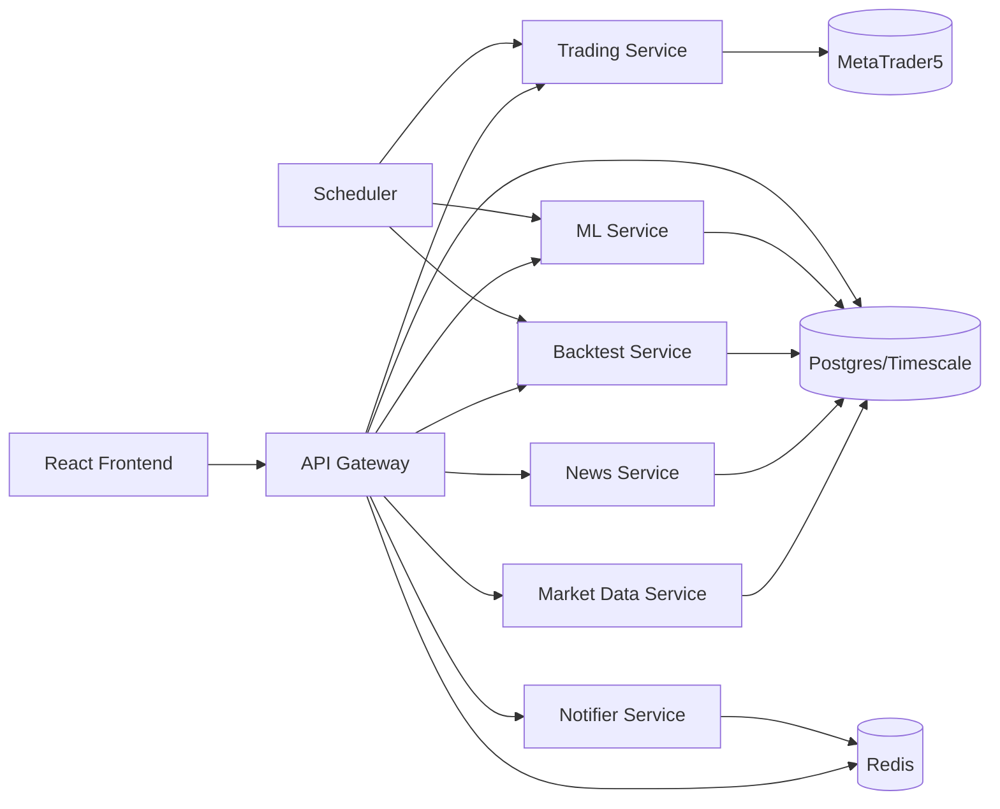

# MTrader Autonomous Trading Platform

Production-oriented, multi-service trading system with secure auth, MT5 execution, risk controls, market/news ingestion, backtesting, model registry, and real-time dashboards.

## Architecture



## Prerequisites
- Docker + Docker Compose v2
- Node.js 18+
- Python 3.11+
- MetaTrader 5 terminal (Windows host or mounted in container)

## Quick start
```bash
cp .env.example .env
# fill required values
docker compose -f docker-compose.prod.yml up --build -d
```

## Development setup
### Backend
```bash
python -m venv .venv
source .venv/bin/activate
pip install -r requirements.txt
uvicorn app.main:app --reload
```

### Frontend
```bash
cd frontend
npm ci
npm run dev
```

### Database
```bash
alembic upgrade head
```

## Environment variables
See `.env.example` for all required values across services.

## API summary
- Auth: `/api/v1/auth/*`
- MT5: `/api/v1/mt5/*`
- Positions/Orders: `/api/v1/trades/*`
- Calendar: `/api/v1/calendar/*`
- Models: `/api/v1/models/*`
- Backtests: `/api/v1/backtests/*`
- Metrics: `/metrics`
- WebSocket: `/ws`

## Testing
```bash
pytest --cov=app
cd frontend && npm run test && npm run test:e2e
```

## Deployment
- CI/CD pipeline: `.github/workflows/production.yml`
- Staging deployment runs after image build + push
- Production promotion occurs only after staging integration tests pass

## Contributing
1. Create feature branch
2. Add tests for all changed modules
3. Pass lint/typecheck/tests
4. Open PR with risk impact and rollback plan

## License
Proprietary - Internal Use Only


## Running Tests

Install test dependencies:

```bash
pip install -r requirements-dev.txt
```

Run all tests:

```bash
pytest tests/
```

Required environment for integration tests:
- PostgreSQL with TimescaleDB (via Docker Compose)
- Redis (via Docker Compose)
- MT5 demo account credentials (for trading_service tests)


## Running Tests in Isolated Environment

```bash
# Start test databases and run migrations
./scripts/setup-test-env.sh

# Run all tests
pytest tests/ -v --cov=src

# Clean up
./scripts/teardown-test-env.sh
```

CI automatically handles test environment setup via Docker services.
